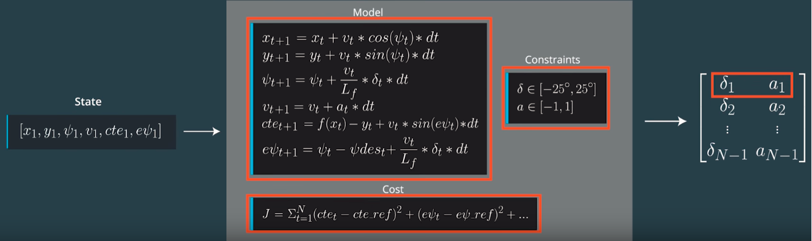

# Overview

The goal of this project is to implement Model Predictive Control (MPC) and to drive a vehicle around a simulated road track. A cross track error (CTE) is calculated in the project code. Additionally, there's a 100 millisecond latency between actuations commands on top of the connection latency.

This solution makes use of the IPOPT and CPPAD libraries to calculate an optimal trajectory and its associated actuation commands in order to minimize error with a third-degree polynomial fit to the given waypoints. The optimization considers only a short duration's worth of waypoints, and produces a trajectory for that duration based upon a model of the vehicle's kinematics and a cost function based mostly on the vehicle's cross-track error (roughly the distance from the track waypoints) and orientation angle error, with other cost factors included to improve performance.

## Model

The implemented MPC is using a global kinematic model to calculate a predicted vehicle trajectory. In the project the kinematic model receives a vehicle ```state``` as a vector of 6 elements:

* vehicle position coordinates ```x``` and ```y```
* vehicle orientation ```psi```
* vehicle velocity ```v```
* vehicle cross track error ```cte``` and
* vehicle orientation error ```epsi```

The first four state vector elements at a timestep ```t``` are provided by the vehicle simulator:

* current vehicle position coordinates ```x[t]``` and ```y[t]```
* vehicle orientation ```psi[t]``` in radians
* vehicle velocity ```v[t]``` in mph

The other two state vector elements, ```cte[t]``` and ```epsi[t]```, are calculated.

The cross track error ```cte[t]``` is calculated as a error of the vehicle position in ```y``` direction by evaluating the vehicle position at ```x``` and substracting the ```y``` coordinate. The simulator provides 6 track waypoints at any timestep ```t``` as 2 vectors ```ptsx``` and ```ptsy``` in global map coordinate system. In order to be evaluated against the actual vehicle position the track waypoints coordinates are transformed from global coordinates to the vehicle coordinate system. This is done by shifting the center of the coordinate system to the vehicle position and rotating it (counterclockwise) ```-psi``` radians to get zero orientation angle in ```x``` direction:

```
double shift_x = ptsx[i] - npx;
double shift_y =  ptsy[i] - npy;
waypoints_x[i] = (shift_x * cos(0-npsi) - shift_y * sin(0-npsi));
waypoints_y[i] = (shift_x * sin(0-npsi) + shift_y * cos(0-npsi));
```

The transformed track waypoints are used to build a 3rd order polynomial ```f(x)``` by polyfit method. The resulting polymomial coeffitients are evaluated against the vehicle ```y``` position by ```polyeval``` method to calculate the cross track error ```cte```. Since the vehicle is located in the center of the coordinate system, ```x``` and ```y``` are ```0```, and 
```cte = polyeval(coeffs, 0);```.

The vehicle orientation error ```epsi``` is calculated as a difference between the actual vehicle orientation angle ```psi``` and a desired orientation. The desired orientation is an angle of the tangent line to the 3rd order polynomial curve ```f(x)``` or ```arctan(f'(x))```, where ```f'(x)``` is a derivative of the polinomial ```f```. Since in the center of the coordinate system ```x = 0```, the desired orientation is calculated ```atan(f'(x)) = atan(coeffs[1])```. Also after the transformation of the coordinates the vehicle is heading in ```x``` direction and the orientation ```psi = 0```, so ```epsi = psi - atan(f'(x)) = -atan(coeff[1])```.

The resulting state vector provided to the MPC is ```[0, 0, 0, v, cte, epsi]```. The MPC is using an optimizer to calculate the vehicle control inputs (actuators), steering angle ```delta``` and acceleration ```a```, and to minimize the cost function.

The kinematic model is using following equations to update the vehicle state after a timestep ```dt```:

```
x[t+1] = x[t] + v[t] * cos(psi[t]) * dt
y[t+1] = y[t] + v[t] * sin(psi[t]) * dt
psi[t+1] = psi[t] + v[t] / Lf * delta[t] * dt
v[t+1] = v[t] + a[t] * dt
cte[t+1] = f(x[t]) - y[t] + v[t] * sin(epsi[t]) * dt
epsi[t+1] = psi[t] - psides[t] + v[t] * delta[t] / Lf * dt
```
The model is using 2 constraints as the actuator limitations of the steering angle ```delta``` and acceleration ```a```, which are defined as the lower and upper boundaries. Such as the steering angle boundaries are from ```-25``` to ```25``` degrees. The acceleration boundaries are from ```-1``` (full brake) to ```1``` (full acceleration).

## Pipeline

The following image shows the overall block diagram of the underlying algorithm. 



Model Predictive Control (MPC) uses control inputs that minimizes the cost function. Before starting the MPC algorithm we set up duration of the trajectory, this means setting up N and dt. Once we choose N and dt, we define vehicle model and constraints as shown in the above diagram. We have two types of constraints, one type is the actuator limitations delta(steering angle) and a(acceleration or brake). The other constraint is the model equation itself. Next step is defining the cost function.Once we set up all these variable, we begin the state feedback loop. First we pass the current state to the MPC solver. The model uses initial state, model, constraints, and cost function to return a vector of control inputs that minimizes the cost function. We just pick the first control input to the vehicle and discard all others. We repeat the loop.

There are 7 types of cost functions that we defined here. Cost functions include a) cross track error b) orientation of the vehicle c) deviation from the refrence speed(100 mph) d) Steering Value e) Acceleration f) Differential Steering g) Differential Acceleration. The trickiest part of this project was choosing the right coefficient for each of the 7 cost functions. For example cost coefficient for the Differential Steering was very important for the vehicle to steer correctly around the curve.

Values for dt and N are chosen empirically. First I started with the values that I used them in the course quize N = 25 and dt = 0.05. However, it seemed this value for dt is very low and the vehicle became very unstable specially the steering angle. By changing dt to 0.1, steering angle became less sensitive to temporal changes and as a result vehicle became more stable. I tweaked with different values of N as well and it seems N = 10 works the best. This means that the vehicles knows the next 1 second of it's state. Given the curves of this route, it is a reasonable value.

Before passing the waypoints to the solver, a polynomial is used to fit the updated vehcile location. Given the global x,y positions of the waypoints and global x,y position of the vehicle, vehicle coordinate gets updated. The updated points are used to fit a polynomial to the vehicle path in order to calculate orientation(epsi) and cross track error(cte). 

Latency of 100 microsecond is considered. Before passing the states to the solver, all the states are getting updated based on the latency of 0.1 second. For example the next cross track error becomes cte + v * sin(epsi) * dt in which dt is the latency of 0.1 second.

## Final Result

[Here](https://www.youtube.com/watch?v=IRv4Z2QoJz4) is a link to the video that I recorded while car was run autonomously.

## Reflections

### Why smaller dt is better?

dt is the interval between two consecutive future states. So if dt is smaller we will be able to predict the states of the vehicle very accurately in near future.

### Why larger N isn't always better?

N is the number of future states we are predicting. N will be directly proportional to the computation time. So larger value of N can cost a lot of computation.

### How does time horizon (N*dt) affect the predicted path?

As discussed above increasing N and decreasing dt can increase the accuracy of future predicted states but this could also affect the overall performance of the MPC algorithm. If the car is at high speeds and we have a Large N and very small dt then the computation could take a larger time and the car could be moving ahead of the predicted state.

The most popular choice is N=10, dt=0.1 which worked well for this project

## Dependencies

* cmake >= 3.5
 * All OSes: [click here for installation instructions](https://cmake.org/install/)
* make >= 4.1(mac, linux), 3.81(Windows)
  * Linux: make is installed by default on most Linux distros
  * Mac: [install Xcode command line tools to get make](https://developer.apple.com/xcode/features/)
  * Windows: [Click here for installation instructions](http://gnuwin32.sourceforge.net/packages/make.htm)
* gcc/g++ >= 5.4
  * Linux: gcc / g++ is installed by default on most Linux distros
  * Mac: same deal as make - [install Xcode command line tools]((https://developer.apple.com/xcode/features/)
  * Windows: recommend using [MinGW](http://www.mingw.org/)
* [uWebSockets](https://github.com/uWebSockets/uWebSockets)
  * Run either `install-mac.sh` or `install-ubuntu.sh`.
  * If you install from source, checkout to commit `e94b6e1`, i.e.
    ```
    git clone https://github.com/uWebSockets/uWebSockets
    cd uWebSockets
    git checkout e94b6e1
    ```
    Some function signatures have changed in v0.14.x. See [this PR](https://github.com/udacity/CarND-MPC-Project/pull/3) for more details.

* **Ipopt and CppAD:** Please refer to [this document](https://github.com/udacity/CarND-MPC-Project/blob/master/install_Ipopt_CppAD.md) for installation instructions.
* [Eigen](http://eigen.tuxfamily.org/index.php?title=Main_Page). This is already part of the repo so you shouldn't have to worry about it.
* Simulator. You can download these from the [releases tab](https://github.com/udacity/self-driving-car-sim/releases).
* Not a dependency but read the [DATA.md](./DATA.md) for a description of the data sent back from the simulator.

## Basic Build Instructions

1. Clone this repo.
2. Make a build directory: `mkdir build && cd build`
3. Compile: `cmake .. && make`
4. Run it: `./mpc`.

## Code Style

Please (do your best to) stick to [Google's C++ style guide](https://google.github.io/styleguide/cppguide.html).

